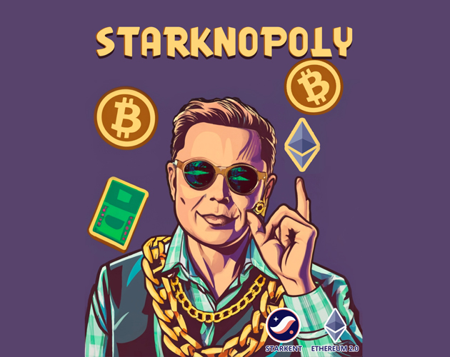

# Starknopoly



Discover an on-chain Monopoly game powered by [Dojo](https://www.dojoengine.org/en/), featuring competitive gameplay, strategic decision-making, dice-based movement, and property transactions.

## Gameplay

The goal of this game project is to create a simplified version of Monopoly to practice using the Cario and on-chain Dojo engines. Monopoly is a multiplayer PvP game where each player's actions are determined by rolling dice, making it suitable for blockchain gaming with low transactions per second (tps) and user-triggered actions.

**Design Approach:**

- Fully on-chain: The game operates entirely on the blockchain, allowing anyone to join or leave the game at any time, unlike traditional Monopoly's limit of 6 players per session.
- Dice-Based Movement: Players move forward by rolling dice for each turn.
- Simplified Economy: Initially, the economic model is simplified, with potential for instability, focusing on getting the game running first.
- Player Interaction: The game incorporates elements of self-strategy and player competition.

**Specific Gameplay:**

- The initial game map is 100x100, preventing players from being too far apart.
- Players start at random positions and can move forward or backward upon character creation.
- In-game currency: Gold coins, non-transferable or tradable between players.
- Players can roll dice every 10 blocks (with variations in block time) to determine their moves.
- Some land blocks can be developed into buildings.

**Buildings:**

1. Hotels: Players can purchase and charge fees to others who land on their hotels. Staying at a hotel costs 10% of its total value, with 9% going to the hotel owner and 1% to a central pool.
2. Banks: Players can purchase banks on land blocks, earning 10 gold coins per step.
3. Starkbucks: Spending gold coins at Starkbucks increases action points. 10 Starkbucks add 0.1 action points per round but require continuous gold coin expenditure.

**Player Interaction:**

- Players can buy back others' properties when landing on them at a 30% premium.
- A central treasury pool accumulates funds from hotel fees and buybacks.

**Treasury Pool:**

- The treasury cannot be inflated; players can only earn funds through gameplay.
- The treasury starts with 100,000 gold coins, and players can purchase coins using Ether (ETH) at a fixed initial rate of 0.00001 ETH per coin.
- Coins in the treasury can be bought by players but cannot be sold.

**Starting the Game:**

- Players begin with 1,000 gold coins and 100 action points, with 5 points restored every hour.
- Players take turns every 10 seconds, providing roughly 20 minutes of playtime per 100 action points.
- Running out of gold coins results in failure, but players can purchase coins from the treasury to continue.

**Tournaments:**

- There are 7-day tournaments where players compete for various achievements, including earning gold coins, owning buildings, and buying properties.
- ETH spent by players to buy coins is refunded at the end of each tournament, minus a 5% fee.

**Treasury Coin Price Formula:**

- The price of buying coins from the treasury is inversely proportional to the number of coins available. (Price curve: x \* y = k)
- The treasury's initial price is set at 100,000 coins for 1 ETH, with k = 100,000.
- As the treasury's coin count decreases, the price increases, and vice versa.

**Game Strategy:**

- Players make decisions about building types, purchasing gold coins from the treasury, and acquiring opponents' properties based on their own strategies, taking into account factors such as player count and building quantity.

This Monopoly-inspired game aims to provide a blockchain-based, self-strategic, and perpetual gaming experience with an evolving economy and competitive player interactions.

### Steps to Execute

Clone repository
`git clone https://github.com/Starknopoly/gameprivate --recursive`

- Build contracts

- Build Frontend

Subsequently, clone this project and execute the following commands in the terminal:

```console
yarn

yarn dev
```

### contracts

## DEV

instal dojo toolchain with `dojoup -v nightly`

go contracts folder

1. terminal_1
`katana --disable-fee`
2. terminal_2, comment world_address
`sozo build && sozo migrate name --test`
3. terminal_3 uncomment world_address
`touch indexer.db`
`torii -d indexer.db`

To avoid redeploying contracts, you can save the Katana state by using the following command.
`katana --disable-fee --load-state ./dump-state.bin --dump-state ./dump-state.bin`